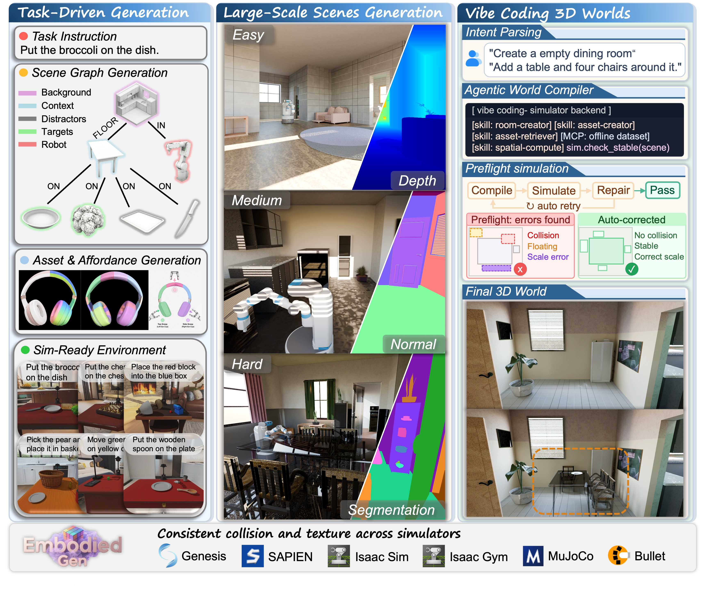
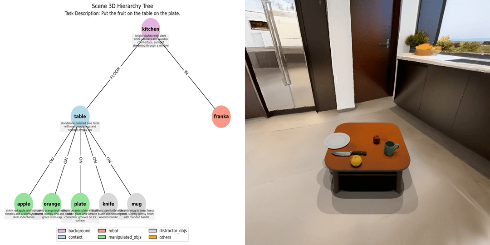
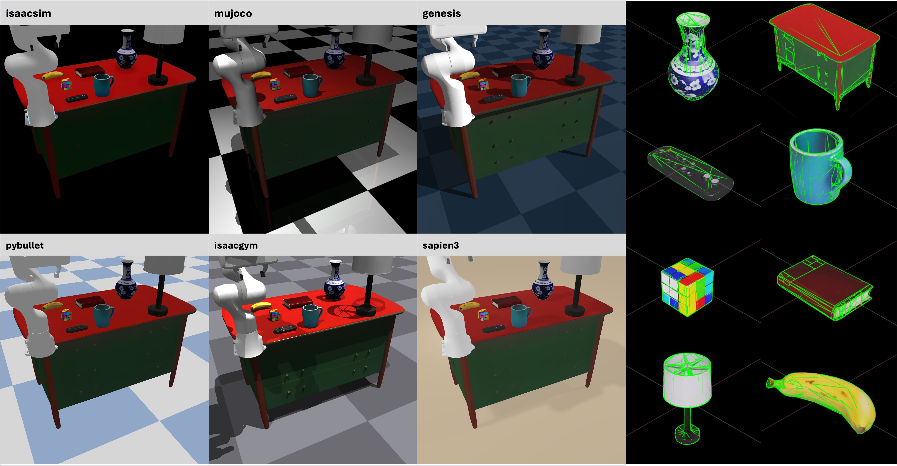
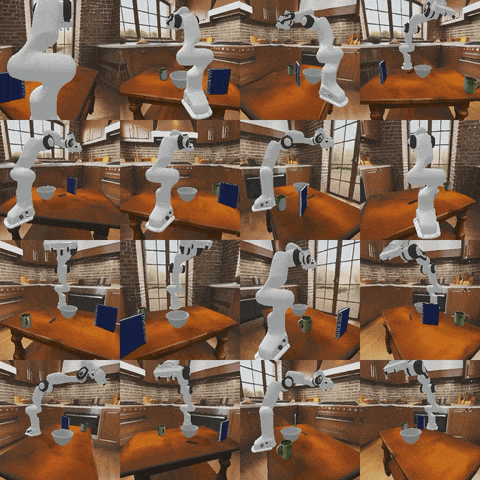
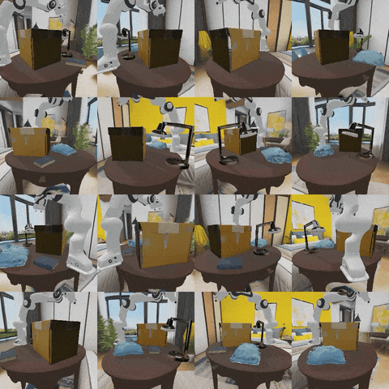

# *EmbodiedGen V2*: An Agentic, Simulation-Ready 3D World Engine for Embodied AI

[](https://horizonrobotics.github.io/EmbodiedGen/)
[](https://horizonrobotics.github.io/EmbodiedGen/docs/)
[](https://github.com/HorizonRobotics/EmbodiedGen)
[](https://arxiv.org/abs/2506.10600)
[](https://arxiv.org/abs/2607.07459)
[](https://youtu.be/MIkJJSVM8L4)
[](https://huggingface.co/datasets/HorizonRobotics/EmbodiedGenData)
<!-- [](https://mp.weixin.qq.com/s/HH1cPBhK2xcDbyCK4BBTbw) -->
[](https://huggingface.co/spaces/HorizonRobotics/EmbodiedGen-Gallery-Explorer)
[](https://huggingface.co/spaces/HorizonRobotics/EmbodiedGen-Image-to-3D)
[](https://huggingface.co/spaces/HorizonRobotics/EmbodiedGen-Text-to-3D)
[](https://huggingface.co/spaces/HorizonRobotics/EmbodiedGen-Texture-Gen)

> **From intent to executable 3D worlds.**
> ***EmbodiedGen*** compiles language, images, and edit commands into **simulation-ready 3D worlds** — physically plausible assets, large-scale scenes, and task-driven interactive environments, deployable across every major robotics simulator.



---

## ✨ What's New in V2

- 💬 **3D Vibe Coding** — build and edit sim-ready scenes through natural-language dialogue via Claude Code slash commands (`/embodiedgen:*`), each edit a bounded, physics-validated skill call.
- 🏠 **Large-scale scene generation** — multi-room, navigable, instance-editable houses at controllable complexity tiers (`minimalist` → `detail`).
- 📦 **One world, every simulator** — a standardized layout loads with consistent geometry, collision, and physics across **SAPIEN, Isaac Sim, Isaac Gym, MuJoCo, Genesis, and PyBullet**.
- 🧩 **Pluggable 3D backends** — switch between **SAM3D**, **TRELLIS**, and the **Hunyuan3D Pro** cloud API with a single flag.
- 🧥 **Beyond rigid bodies** — text-conditioned garments deploy as deformable meshes in Genesis.
- 🦾 **Part-level affordance** — functional part segmentation, per-part semantics, and simulation-validated 6-DoF grasp poses for any generated asset.
- 🤖 **Closed-loop robot learning** — policies trained purely in EmbodiedGen-generated worlds transfer to real robots (task success **9.7 → 79.8%** in sim, **21.7 → 75.0%** on real robots, from [sim2real RL paper](https://arxiv.org/abs/2603.18532)).

## 📋 Table of Contents

- [🚀 Quick Start](#quick-start)
- [🧱 Generate — Sim-Ready 3D Assets](#generate-assets)
- [🏠 Scale — Large-Scale Scenes](#scale-scenes)
- [🌍 Compose — Task-Driven Worlds](#compose-worlds)
- [💬 Edit — 3D Vibe Coding](#vibe-coding)
- [📦 Export — Any Simulators](#any-simulators)
- [🤖 Train — Robot Learning](#robot-learning)
- [⚙️ Articulated Object Generation](#articulated-object-generation)
- [🧩 3D Scene Completion](#3d-scene-completion)

---

<h2 id="quick-start">🚀 Quick Start</h2>

```sh
git clone https://github.com/HorizonRobotics/EmbodiedGen.git
cd EmbodiedGen
git checkout v2.0.0
conda create -n embodiedgen python=3.10.13 -y
conda activate embodiedgen
# bash install.sh cu126 && conda deactivate && conda activate embodiedgen # Optional: if you don't have local cuda126.
bash install.sh basic # around 10 mins
```

Set up the GPT agent (required by most pipelines): update the API key in `embodied_gen/utils/gpt_config.yaml`. Then generate your first sim-ready asset:

```sh
img3d-cli --image_path apps/assets/example_image/sample_00.jpg \
    --n_retry 2 --output_root outputs/imageto3d
# → outputs/imageto3d/sample_00/result: URDF + mesh(.obj/.glb) + 3DGS(.ply) + video
```

A pre-built Docker image is also available on [Docker Hub](https://hub.docker.com/repository/docker/wangxinjie/embodiedgen).

➡️ Full guide: [Installation & Setup](https://horizonrobotics.github.io/EmbodiedGen/docs/install.html) · [Docker](docker/README.md)

---

<h2 id="generate-assets">🧱 Generate — Sim-Ready 3D Assets</h2>

Turn a **single image** or a **text prompt** into a simulation-ready asset: metric geometry, convex collision proxy, VLM-inferred physical properties (scale, mass, friction), quality-checked with automatic retries — packaged as URDF + mesh + 3DGS.


```sh
# Image → 3D (backends: SAM3D | TRELLIS | HUNYUAN3D, via --image3d_model)
img3d-cli --image_path apps/assets/example_image/sample_01.jpg --output_root outputs/imageto3d

# Text → 3D (backends: SAM3D | TRELLIS | HUNYUAN3D, via --image3d_model)
text3d-cli --prompts "small bronze figurine of a lion" --output_root outputs/textto3d

# Re-texture an existing mesh (Chinese & English prompts)
texture-cli --mesh_path apps/assets/example_texture/meshes/horse.obj \
    --prompt "A gray horse head with flying mane and brown eyes" --output_root outputs/texture_gen
```

The same generate-and-export path reaches **soft bodies**: text-conditioned garments deploy as deformable meshes in Genesis.

Any generated URDF can be further annotated with **part-level affordances** — functional part segmentation, per-part semantics, and simulation-validated 6-DoF grasps (requires `bash install.sh affordance`):

```sh
affordance-cli --urdf-paths apps/assets/example_affordance/ear_hear/sample.urdf \
    --output-dirs outputs/affordance_annotation/ear_hear
```

➡️ Full guides: [Image-to-3D](https://horizonrobotics.github.io/EmbodiedGen/docs/tutorials/image_to_3d.html) · [Text-to-3D](https://horizonrobotics.github.io/EmbodiedGen/docs/tutorials/text_to_3d.html) · [Texture Generation](https://horizonrobotics.github.io/EmbodiedGen/docs/tutorials/texture_edit.html) · [Soft-Body Simulation](https://horizonrobotics.github.io/EmbodiedGen/docs/tutorials/soft_body.html) · [Affordance](https://horizonrobotics.github.io/EmbodiedGen/docs/tutorials/affordance.html)

---

<h2 id="scale-scenes">🏠 Scale — Large-Scale Scenes</h2>

Go beyond tabletops: generate **multi-room, navigable, instance-editable houses** as sim-ready backgrounds at a controllable complexity tier, or create photo-realistic **3DGS background scenes** from a text prompt.


```sh
# Room / house from a natural-language description (requires `bash install.sh room`)
room-cli -m embodied_gen.scripts.room_gen.gen_room \
    --output-root outputs/rooms --prompt "Wipe the table in a simple dining room"
# or specify the profile explicitly: --room-type Kitchen --seed 42 --complexity simple

# 3DGS background scene from text (requires `bash install.sh scene3d`)
scene3d-cli --prompts "Art studio with easel and canvas" --output_dir outputs/bg_scenes/ --seed 0
```

➡️ Full guides: [Room Generation](https://horizonrobotics.github.io/EmbodiedGen/docs/tutorials/room_gen.html) · [3D Scene Generation](https://horizonrobotics.github.io/EmbodiedGen/docs/tutorials/scene_gen.html)

---

<h2 id="compose-worlds">🌍 Compose — Task-Driven Worlds</h2>

From a natural-language task description, EmbodiedGen parses a **scene graph** and composes a physically stable, directly loadable **interactive 3D world** — background, context objects, manipulated targets, distractors, and robot.

<table>
  <tr>
    <td></td>
    <td></td>
  </tr>
</table>

```sh
layout-cli --task_descs "Place the pen in the mug on the desk" \
    --bg_list "outputs/example_gen_scenes/scene_part_list.txt" \
    --output_root "outputs/layouts_gen" --insert_robot

# Load the generated layout into SAPIEN simulation
sim-cli --layout_path "outputs/layouts_gen/task_0000/layout.json" \
    --output_dir "outputs/layouts_gen/task_0000/sapien_render" --insert_robot
```

➡️ Full guide: [Layout Generation](https://horizonrobotics.github.io/EmbodiedGen/docs/tutorials/layout_gen.html) (background download, batch generation, layout randomization)

---

<h2 id="vibe-coding">💬 Edit — 3D Vibe Coding</h2>

Build and edit sim-ready 3D worlds **through dialogue**. EmbodiedGen ships a Claude Code plugin whose slash commands wrap the generation and spatial-computing skills — each instruction is a bounded, physics-validated skill call that preserves a deployable world state.


```sh
bash install/install_agent_plugin.sh  # register the plugin in Claude Code
```

| Command | What it does |
|---------|--------------|
| `/embodiedgen:gen_assets` | Generate 3D assets from images or text |
| `/embodiedgen:gen_indoor` | Generate rooms or multi-room houses |
| `/embodiedgen:gen_bg` | Generate 3DGS background scenes |
| `/embodiedgen:gen_layout` | Compose task-driven interactive worlds |
| `/embodiedgen:vibe3d` | Insert / remove / place objects in a scene via natural language |
| `/embodiedgen:sim` | Render layouts in SAPIEN simulation |
| `/embodiedgen:convert` | Export assets to USD / MJCF / URDF |
| `/embodiedgen:process` | Scale or rotate existing assets |

➡️ Full guide: [3D Vibe Coding](https://horizonrobotics.github.io/EmbodiedGen/docs/tutorials/vibe_coding.html)

---

<h2 id="any-simulators">📦 Export — Any Simulators</h2>

One standardized asset, six engines, zero manual adaptation — consistent geometry, collision, textures, and physical metadata everywhere.

| Simulator | How to use EmbodiedGen assets |
|-----------|------------------------------|
| [SAPIEN](https://github.com/haosulab/SAPIEN) / [IsaacGym](https://github.com/isaac-sim/IsaacGymEnvs) / [PyBullet](https://github.com/bulletphysics/bullet3) | Generated `.urdf` used **directly** |
| [MuJoCo](https://github.com/google-deepmind/mujoco) / [Genesis](https://github.com/Genesis-Embodied-AI/Genesis) | `MeshtoMJCFConverter` → MJCF |
| [IsaacSim](https://github.com/isaac-sim/IsaacSim) | `MeshtoUSDConverter` → USD |



➡️ Full guide: [Any Simulators](https://horizonrobotics.github.io/EmbodiedGen/docs/tutorials/any_simulators.html) (conversion API & examples)

---

<h2 id="robot-learning">🤖 Train — Robot Learning</h2>

Generated worlds are not just viewable — they are **online training environments**. Spin up parallel `gym` environments from a generated layout, record sensor and trajectory data, and evaluate grasp quality of generated assets.

<table>
  <tr>
    <td></td>
    <td></td>
  </tr>
</table>

```sh
# Parallel simulation environments from a generated layout
python embodied_gen/scripts/parallel_sim.py \
    --layout_file "outputs/layouts_gen/task_0000/layout.json" \
    --output_dir "outputs/parallel_sim/task_0000" --num_envs 16

# Grasp-quality evaluation of a generated URDF (ManiSkill + SAPIEN)
python embodied_gen/scripts/eval_collision_success.py \
    --urdf-path outputs/imageto3d/sample_00/result/sample_00.urdf --num-trials 4
```

In a companion [sim-to-real RL study](https://arxiv.org/abs/2603.18532), policies trained purely in EmbodiedGen-generated worlds reached **79.8%** simulation and **75.0%** real-robot task success.

➡️ Full guide: [Robot Learning](https://horizonrobotics.github.io/EmbodiedGen/docs/tutorials/robot_learning.html)

---

<h2 id="articulated-object-generation">⚙️ Articulated Object Generation</h2>

See our paper **DIPO** published in NeurIPS 2025:
[[arXiv]](https://arxiv.org/abs/2505.20460) | [[Gradio Demo]](https://huggingface.co/spaces/HorizonRobotics/DIPO) | [[Code]](https://github.com/RQ-Wu/DIPO)


---

<h2 id="3d-scene-completion">🧩 3D Scene Completion</h2>

See our paper **3D-Fixer** published in CVPR 2026:
[[arXiv]](https://arxiv.org/abs/2604.04406) | [[Project Page]](https://zx-yin.github.io/3dfixer/) | [[Online Demo]](https://huggingface.co/spaces/HorizonRobotics/3D-Fixer) | [[Code]](https://github.com/HorizonRobotics/3D-Fixer)


---

## For Developer

```sh
pip install -e .[dev] && pre-commit install
python -m pytest # Pass all unit-test are required.
```

## 📚 Citation

If you use EmbodiedGen in your research or projects, please cite:

```bibtex
@misc{wang2026embodiedgenv2agenticsimulationready,
      title={EmbodiedGen V2: An Agentic, Simulation-Ready 3D World Engine for Embodied AI},
      author={Xinjie Wang and Liu Liu and Taojun Ding and Andrew Choi and Chaodong Huang and Mengao Zhao and Ziang Li and Jackson Jiang and Chunlei Yu and Shengxiang Liu and Wei Xu and Zhizhong Su},
      year={2026},
      eprint={2607.07459},
      archivePrefix={arXiv},
      primaryClass={cs.RO},
      url={https://arxiv.org/abs/2607.07459},
}
```
```bibtex
@misc{wang2025embodiedgengenerative3dworld,
  title         = {EmbodiedGen: Towards a Generative 3D World Engine for Embodied Intelligence},
  author        = {Xinjie Wang and Liu Liu and Yu Cao and Ruiqi Wu and Wenkang Qin and
                   Dehui Wang and Wei Sui and Zhizhong Su},
  year          = {2025},
  eprint        = {2506.10600},
  archivePrefix = {arXiv},
  primaryClass  = {cs.RO},
  url           = {https://arxiv.org/abs/2506.10600}
}
```

---

## 🙌 Acknowledgement

EmbodiedGen builds upon the following amazing projects and models:
🌟 [Trellis](https://github.com/microsoft/TRELLIS) | 🌟 [Hunyuan-Delight](https://huggingface.co/tencent/Hunyuan3D-2/tree/main/hunyuan3d-delight-v2-0) | 🌟 [Hunyuan3D-Part](https://github.com/Tencent-Hunyuan/Hunyuan3D-Part) | 🌟 [GraspGen](https://github.com/NVlabs/GraspGen) | 🌟 [Segment Anything](https://github.com/facebookresearch/segment-anything) | 🌟 [Rembg](https://github.com/danielgatis/rembg) | 🌟 [RMBG-1.4](https://huggingface.co/briaai/RMBG-1.4) | 🌟 [Stable Diffusion x4](https://huggingface.co/stabilityai/stable-diffusion-x4-upscaler) | 🌟 [Real-ESRGAN](https://github.com/xinntao/Real-ESRGAN) | 🌟 [Kolors](https://github.com/Kwai-Kolors/Kolors) | 🌟 [ChatGLM3](https://github.com/THUDM/ChatGLM3) | 🌟 [Aesthetic Score](http://captions.christoph-schuhmann.de/aesthetic_viz_laion_sac+logos+ava1-l14-linearMSE-en-2.37B.html) | 🌟 [Pano2Room](https://github.com/TrickyGo/Pano2Room) | 🌟 [Diffusion360](https://github.com/ArcherFMY/SD-T2I-360PanoImage) | 🌟 [Kaolin](https://github.com/NVIDIAGameWorks/kaolin) | 🌟 [diffusers](https://github.com/huggingface/diffusers) | 🌟 [gsplat](https://github.com/nerfstudio-project/gsplat) | 🌟 [QWEN-2.5VL](https://github.com/QwenLM/Qwen2.5-VL) | 🌟 [SD3.5](https://huggingface.co/stabilityai/stable-diffusion-3.5-medium) | 🌟 [ManiSkill](https://github.com/haosulab/ManiSkill) | 🌟 [SAM3D](https://github.com/facebookresearch/sam-3d-objects) | 🌟 [infinigen](https://github.com/princeton-vl/infinigen)

---

## ⚖️ License

This project is licensed under the [Apache License 2.0](docs/LICENSE). See the `LICENSE` file for details.
