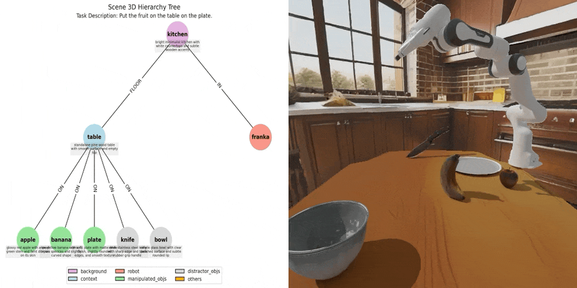

# Tutorials & Interface Usage

Welcome to the tutorials for **EmbodiedGen V2** — an agentic, simulation-ready 3D world engine for embodied AI. The tutorials are organized by capability: **generate** sim-ready assets, **scale** to large scenes, **compose** task-driven worlds, **edit** them through dialogue, **export** to any simulator, and **train** robot policies inside.

---

!!! tip "Prerequisites"
    Make sure to finish the [Installation Guide](../install.md) before starting tutorial. Missing dependencies will cause initialization errors. Model weights are automatically downloaded on first run.

---

## 🧱 Generate — Sim-Ready 3D Assets

### [🖼️ Image-to-3D](image_to_3d.md)

Generate **physically plausible 3D assets** from a single input image, supporting digital twin and simulation environments.

  

    

      <model-viewer
        src="https://raw.githubusercontent.com/HochCC/ShowCase/main/image2/sample_00.glb"
        auto-rotate
        camera-controls
        style="display:block; width:100%; height:250px; background-color: #f8f8f8;">
      </model-viewer>
    

    

      <model-viewer
        src="https://raw.githubusercontent.com/HochCC/ShowCase/main/image2/sample_01.glb"
        auto-rotate
        camera-controls
        style="display:block; width:100%; height:250px; background-color: #f8f8f8;">
      </model-viewer>
    

    

      <model-viewer
        src="https://raw.githubusercontent.com/HochCC/ShowCase/main/image2/sample_19.glb"
        auto-rotate
        camera-controls
        style="display:block; width:100%; height:250px; background-color: #f8f8f8;">
      </model-viewer>
    

  

  

  

---

### [📝 Text-to-3D](text_to_3d.md)

Create **physically plausible 3D assets** from **text descriptions**, supporting a wide range of geometry, style, and material details.

    

        

        <model-viewer
            src="https://raw.githubusercontent.com/HochCC/ShowCase/main/text2/sample3d_0.glb"
            auto-rotate
            camera-controls
            background-color="#ffffff"
            style="display:block; width: 100%; height: 160px; border-radius: 12px;"
            >
        </model-viewer>
        
"small bronze figurine of a lion"

        

        

        <model-viewer
            src="https://raw.githubusercontent.com/HochCC/ShowCase/main/text2/sample3d_1.glb"
            auto-rotate
            camera-controls
            background-color="#ffffff"
            style="display:block; width: 100%; height: 160px;">
        </model-viewer>
        
"A globe with wooden base"

        

        

        <model-viewer
            src="https://raw.githubusercontent.com/HochCC/ShowCase/main/text2/sample3d_2.glb"
            auto-rotate
            camera-controls
            background-color="#ffffff"
            style="display:block; width: 100%; height: 160px;">
        </model-viewer>
        
"wooden table with embroidery"

        

    

    

    

---

### [🎨 Texture Generation](texture_edit.md)

Generate **high-quality textures** for 3D meshes using **text prompts**, supporting both Chinese and English, to enhance the visual appearance of existing 3D assets.

  

    

      <model-viewer
        src="https://raw.githubusercontent.com/HochCC/ShowCase/main/edit2/robot_text.glb"
        auto-rotate
        camera-controls
        camera-orbit="180deg auto auto"
        style="display:block; width:100%; height:250px; background-color: #f8f8f8;">
      </model-viewer>
    

    

      <model-viewer
        src="https://raw.githubusercontent.com/HochCC/ShowCase/main/edit2/horse.glb"
        auto-rotate
        camera-controls
        camera-orbit="90deg auto auto"
        style="display:block; width:100%; height:250px; background-color: #f8f8f8;">
      </model-viewer>
    

  

  

  

---

### [🧥 Soft-Body Simulation](soft_body.md)

Text-conditioned **garments** deploy as **deformable meshes** in Genesis — the same generate-and-export path, beyond rigid bodies.

### [⚙️ Articulated Objects (DIPO)](articulated_gen.md)

Generate **articulated objects** from dual-state images with **DIPO** (NeurIPS 2025).

### [🦾 Affordance](affordance.md)

Semantic part segmentation and grasp pose annotation for sim-ready assets.

---

## 🏠 Scale — Large-Scale Scenes

### [🏠 Room Generation](room_gen.md)

Generate **multi-room, navigable, instance-editable indoor scenes** at a controllable complexity tier, exported to URDF/USD.

### [🌍 3D Scene Generation](scene_gen.md)

Generate **physically consistent and visually coherent 3D environments** from text prompts. Typically used as **background** 3DGS scenes in simulators for efficient and photo-realistic rendering.

---

## 🌍 Compose — Task-Driven Worlds

### [🏞️ Layout Generation](layout_gen.md)

Generate diverse, physically realistic, and scalable **interactive 3D scenes** from natural language task descriptions, while also modeling the robot and manipulable objects.

  
  
  
  

### [🔧 Real-to-Sim Digital Twin Creation](digital_twin.md)

Recreate real-world scenes in simulation with physically plausible digital twins.

  

---

## 💬 Edit — 3D Vibe Coding

### [💬 3D Vibe Coding](vibe_coding.md)

Build and edit sim-ready 3D worlds **through natural-language dialogue** via Claude Code slash commands (`/embodiedgen:*`) — each instruction a bounded, physics-validated skill call.

  

---

## 📦 Export — Any Simulators

### [🎮 Use in Any Simulator](any_simulators.md)

Seamlessly use EmbodiedGen-generated assets in major simulators like **IsaacSim**, **MuJoCo**, **Genesis**, **PyBullet**, **IsaacGym**, and **SAPIEN**, featuring **accurate physical collisions** and **consistent visual appearance**.

  

---

## 🤖 Train — Robot Learning

### [🏎️ Robot Learning](robot_learning.md)

Spin up **parallel simulation environments** with `gym.make`, record sensor and trajectory data, and evaluate grasp quality of generated assets.

  
  

